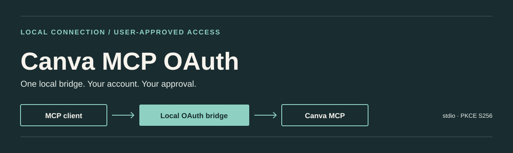

<p align="center">
  
</p>

<p align="center">
  <a href="LICENSE"></a>
  <a href="https://github.com/AmoureuxID/canva-mcp/actions/workflows/ci.yml"></a>
</p>

<h1 align="center">Canva MCP OAuth</h1>

<p align="center">
  A local OAuth bridge from a stdio-capable MCP client to Canva's official MCP server.<br />
  Your Canva account. Your browser approval. Credentials stay with your OS user.
</p>

<p align="center"><strong>New here?</strong> Follow the <a href="GUIDE.md">full setup guide</a>, or use the npm quick start below.</p>

This is an independent project, not affiliated with Canva. It forwards MCP tool and resource requests, but does not install itself into your AI client or edit a design by itself.

## Install

[`canva-mcp@0.1.0`](https://www.npmjs.com/package/canva-mcp) is available on npmjs.com. Use Node.js 20.11 or newer, a local browser, and an MCP client that supports `stdio`. Install it with:

```sh
npm install --global canva-mcp
canva-mcp login
canva-mcp status
```

To install directly from the source instead:

```sh
git clone https://github.com/AmoureuxID/canva-mcp.git
cd canva-mcp
npm ci
npm install --global .
canva-mcp login
canva-mcp status
```

The trailing `.` installs the checked-out source, not a registry package. If you prefer no global installation, use `node bin/canva-mcp-stdio.mjs login` from the checkout. Install and run under the same OS account, and keep npm's global executable directory on your `PATH`.

Review the requested permissions and approve access yourself in a browser on the same computer. If no tab opens, use the one-time URL printed by the still-running login command. Do not share a callback URL, authorization code, or token. The login attempt expires after ten minutes.

## Connect your MCP client

For an npm installation, configure the client to launch `canva-mcp` with the `serve` argument. For a source checkout, you can instead point your client's `stdio` configuration to Node and the **absolute** path to the entry point:

```json
{
  "mcpServers": {
    "canva": {
      "command": "node",
      "args": ["/absolute/path/to/canva-mcp/bin/canva-mcp-stdio.mjs", "serve"]
    }
  }
}
```

The JSON above is a generic shape; each MCP client may use different settings. Restart or reload the client after configuring it. `serve` writes MCP protocol messages to standard output, so it is intended to be launched by the client rather than used as an interactive shell. [The guide](GUIDE.md#configure-a-stdio-mcp-client) covers Windows paths, OS user accounts, and DSH without replacing an existing connector.

## What this bridge handles

- OAuth authorization with PKCE S256 and a temporary `127.0.0.1` callback, approved by the person signing in.
- Per-user credential storage, refresh-token rotation, and MCP forwarding to `https://mcp.canva.com/mcp`.
- `login`, `serve`, `status`, and `logout` commands. `status` reports stored credentials, not whether a revoked grant will still work. `logout` removes local tokens; revoke access separately in Canva settings if needed.

The default OAuth request names `profile:read`, `design:meta:read`, `design:content:read`, and `folder:read`. **Do not treat those scope names as a read-only guarantee:** with this grant, the upstream server created a folder and saved a text edit on a copied test design. This bridge forwards available tool calls without blocking write operations. Canva may still deny particular tools based on account permissions. Review every proposed write before running it. Clients supporting only a remote HTTP MCP URL cannot use this local stdio bridge directly.

## Have an AI agent install it

[Copy the guarded agent prompt from the guide](GUIDE.md#give-the-setup-task-to-an-ai-agent). It directs the agent to check the real MCP client settings, show you any config edit before applying it, and leave browser approval to you. Do not provide the agent with a credential file, OAuth code, callback URL, or token.

## Status, checks, and limits

The CI badge reflects the current [GitHub Actions workflow](https://github.com/AmoureuxID/canva-mcp/actions/workflows/ci.yml); inspect the run details before relying on a platform result. The workflow defines Windows, macOS, and Ubuntu jobs for Node 20, 22, and 24. Tests and package inspection run with:

```sh
npm ci
npm test
npm pack --dry-run --json
```

An isolated install of the published `canva-mcp@0.1.0` ran `canva-mcp status`. A live connection listed tools, read and edited text on an isolated test copy, then read the saved text back; the source design stayed unchanged. This verifies those specific read and write operations, not every advertised Canva tool or a clean-machine login. [Troubleshooting](GUIDE.md#troubleshooting), [credential storage](GUIDE.md#permissions-and-credential-storage), and [release checks](GUIDE.md#local-checks-and-npm-release) are in the guide.

MIT license: [LICENSE](LICENSE).
